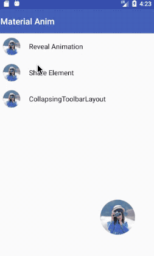
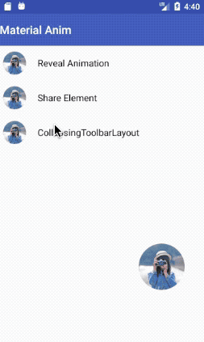
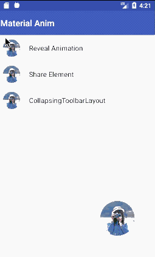

## Share Element
由一张图片过度到一个界面，适用于购物车图片直接跳转到商品详情界面，圆形按钮的过度也可以应用于圆形菜单里
<p align="center">
    
</p>

### 实现原理
利用android 5.0 提供的方法，实现共享元素动画的过度，实现原理很简单，在界面跳转的时候加入以下代码

1. **java代码**

	```
	//第一个界面跳转的时候执行
	Intent shareIntent = new Intent(MainActivity.this, ShareElementActivity.class);
	                                String transitionName = getString(R.string.share_tag);
	                                ActivityOptionsCompat transitionActivityOptions
	                                        = ActivityOptionsCompat.makeSceneTransitionAnimation(MainActivity.this, holder.item_image, transitionName);
	                                startActivity(shareIntent, transitionActivityOptions.toBundle());
	```
	**makeSceneTransitionAnimation(Activity activity,View sharedElement, String sharedElementName)**
	
	makeSceneTransitionAnimation中参数sharedElement就是传入第一个界面要与第二个界面共有的view元素，sharedElementName这个参数可以随便起名，他相当于tag，系统就是根据这个tag来定位两个界面元素的位置，然后进行动画渲染的

	```
	//第二个界面动画完成回调监听，控制进出动画效果
	 setEnterSharedElementCallback(ImageTransitionUtil.DEFAULT_SHARED_ELEMENT_CALLBACK);
	```
	在 **setEnterSharedElementCallback** 里面可以实现自己想要的动画效果

2. **布局文件代码**<br>
这里用系统自带的ImageView就可以，记住，两个界面跳转activity中的共享元素ImageView，一定要设置这个属性 **transitionName** 上文说过，这个就是相当于tag，系统是根据这个来定位的，所以一定要设置。

	```
	   <ImageView
	            android:id="@+id/image"
	            android:layout_width="match_parent"
	            android:layout_height="300dp"
	            android:src="@drawable/sample"
	            android:transitionName="@string/share_tag"
	            />
	```
<br>

## CollapsingToolbarLayout

折叠式的标题栏，这个是系统提供的动画效果，引用系统控件就好了
<p align="center">
    
</p>

### 代码实现
1. **gradle里的引用**

	```
	compile 'com.android.support:design:22.2.1'
	```

2. **java代码**<br>

		@Override
		protected void onCreate(@Nullable Bundle savedInstanceState) {
		    super.onCreate(savedInstanceState);
		    setContentView(R.layout.activity_collapsing_toolbar);
		    ButterKnife.bind(this);
		    content.setText(R.string.content);
			initToolbar();
		}
		
		private void initToolbar() {
		    collapsingToolbar.setTitle("折叠式标题栏");
		    setSupportActionBar(toolbar);
		    getSupportActionBar().setDisplayHomeAsUpEnabled(true);
		}
		//toolbar返回事件实现
		@Override
		public boolean onOptionsItemSelected(MenuItem item) {
		    if (item.getItemId() == android.R.id.home) {
		        finish();
		        return true;
		    }
		    return super.onOptionsItemSelected(item);
		}

3. **布局文件代码**

	
	```
		<android.support.design.widget.CoordinatorLayout xmlns:android="http://schemas.android.com/apk/res/android"
		    xmlns:app="http://schemas.android.com/apk/res-auto"
		    android:id="@+id/main_content"
		    android:layout_width="match_parent"
		    android:layout_height="match_parent">
		
		    <android.support.design.widget.AppBarLayout
		        android:id="@+id/appbar"
		        android:layout_width="match_parent"
		        android:layout_height="300dp"
		        android:theme="@style/ThemeOverlay.AppCompat.Dark.ActionBar">
		
		        <android.support.design.widget.CollapsingToolbarLayout
		            android:id="@+id/collapsing_toolbar"
		            android:layout_width="match_parent"
		            android:layout_height="match_parent"
		            app:contentScrim="?attr/colorPrimary"
		            app:layout_scrollFlags="scroll|exitUntilCollapsed"
		            app:title="Share Element">
		
		            <ImageView
		                android:id="@+id/image"
		                android:layout_width="match_parent"
		                android:layout_height="match_parent"
		                android:src="@drawable/sample"
		                android:scaleType="centerCrop"
		                app:layout_collapseMode="parallax"
		                app:layout_collapseParallaxMultiplier="0.5"
		                />
		
		            <android.support.v7.widget.Toolbar
		                android:id="@+id/toolbar"
		                android:layout_width="match_parent"
		                android:layout_height="?attr/actionBarSize"
		                app:layout_collapseMode="pin" />
		
		        </android.support.design.widget.CollapsingToolbarLayout>
		
		    </android.support.design.widget.AppBarLayout>
		
		    <android.support.v4.widget.NestedScrollView
		        android:layout_width="match_parent"
		        android:layout_height="match_parent"
		        app:layout_behavior="@string/appbar_scrolling_view_behavior">
		
		        <TextView
		            android:id="@+id/content"
		            android:layout_width="match_parent"
		            android:layout_height="match_parent"
		            android:text="test"
		            android:textColor="@color/black"
		            android:textSize="20sp"
		            android:padding="10dp"/>
		
		    </android.support.v4.widget.NestedScrollView>
		
		</android.support.design.widget.CoordinatorLayout>
		
	```

### 布局文件的一些属性说明
1. **layout_scrollFlags**
   - scroll - 想滚动就必须设置这个。
   - enterAlways - 实现quick return效果, 当向下移动时，立即显示View（比如Toolbar)。
   - exitUntilCollapsed - 向上滚动时收缩View，但可以固定Toolbar一直在上面。
   - enterAlwaysCollapsed - 当你的View已经设置minHeight属性又使用此标志时，你的View只能以最小高度进入，只有当滚动视图到达顶部时才扩大到完整高度
2. **layout_collapseMode**
   - pin - 设置为这个模式时，当CollapsingToolbarLayout完全收缩后，Toolbar还可以保留在屏幕上。
   - parallax - 设置为这个模式时，在内容滚动时，CollapsingToolbarLayout中的View（比如ImageView)也可以同时滚动，实现视差滚动效果，通常和layout_collapseParallaxMultiplier(设置视差因子)搭配使用。
   - layout_collapseParallaxMultiplier(视差因子) - 设置视差滚动因子，值为：0~1
3. 使用CollapsingToolbarLayout时必须把title设置到CollapsingToolbarLayout上，设置到Toolbar上不会显示

	
	```
	collapsingToolbar.setTitle("折叠式标题栏");
	```

<br>

## RevealAnimation
google爸爸自从5.0之后对动画效果特别注重，这里给大家介绍一个波纹效果，也是系统提供的

<p align="center">
    
</p>

#### 实现原理

```
  @RequiresApi(api = Build.VERSION_CODES.LOLLIPOP)
    private Animator animateRevealColorFromCoordinates(ViewGroup viewRoot, @ColorRes int color, int pointx, int pointY) {
        float finalRadius = (float) Math.hypot(viewRoot.getWidth(), viewRoot.getHeight());
        //由于toolbar是自己绘制的所以要减去这个高度
        pointY = pointY - toolbarHeight;
        Animator anim = ViewAnimationUtils.createCircularReveal(viewRoot, pointx, pointY, 0, finalRadius);
        viewRoot.setBackgroundColor(ContextCompat.getColor(this, color));
        anim.setDuration(500);
        anim.setInterpolator(new AccelerateDecelerateInterpolator());
        anim.start();
        return anim;
    }
```
##### ViewAnimationUtils.createCircularReveal(View view, int centerX,  int centerY, float startRadius, float endRadius)
重点是这个方法，设置在哪个View里绘制波纹，起始点及半径就可以实现了，很多开源的button波纹效果都是基于这个实现再次封装的


### 文档地址: [基于Android 系统的动画总结](http://www.jianshu.com/p/8ee810a6b1f7)
